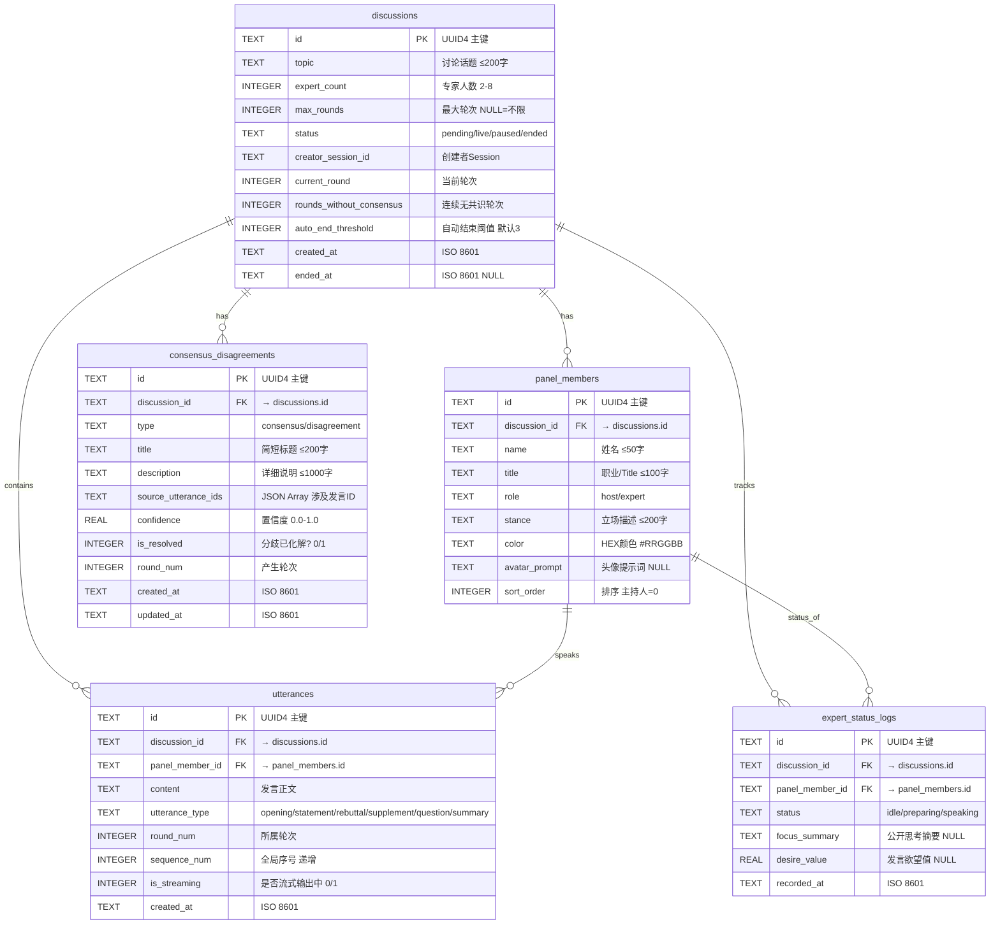

# AI Panel Studio — 实体关系图 (ER Diagram)

> **阶段**: SDD  
> **日期**: 2026-06-17

---

## 1. 完整 ER 图



---

## 2. 核心业务关系说明

### 2.1 Discussion → PanelMember (1:N)

```
┌──────────────┐        ┌──────────────────────┐
│  discussion  │ 1    N │    panel_member       │
│              ├────────┤                      │
│  id = "d1"   │        │  discussion_id = "d1" │
└──────────────┘        │  role = "host"        │
                        │  role = "expert" × N   │
                        └──────────────────────┘
```

- 一个讨论有且仅有 **1 位主持人**（role=host）
- 一个讨论有 **2-8 位专家**（role=expert）
- 主持人 sort_order = 0

### 2.2 PanelMember → Utterance (1:N)

```
┌──────────────────┐        ┌──────────────────────┐
│  panel_member     │ 1    N │     utterance         │
│                  ├────────┤                      │
│  id = "pm1"      │        │  panel_member_id="pm1" │
│  role = "host"   │        │  type = "opening"      │
└──────────────────┘        │  type = "question"     │
                            │  type = "summary"      │
                            └──────────────────────┘
```

- 每位嘉宾可发表多条发言
- 发言类型标识语义角色

### 2.3 Discussion → ConsensusDisagreement (1:N) + Utterance 引用

```
┌──────────────┐     ┌─────────────────────────┐
│  discussion  │ 1  N│ consensus_disagreement  │
│              ├─────┤                         │
│  id = "d1"   │     │  discussion_id = "d1"    │
└──────────────┘     │  source_utterance_ids =   │
                     │    ["u1","u3","u5"]       │
                     └─────────┬───────────────┘
                               │ JSON Array 引用
                               ▼
                     ┌─────────────────┐
                     │   utterances     │
                     │  id IN (...)     │
                     └─────────────────┘
```

- 共识/分歧通过 JSON Array 引用多条发言
- 不在 DB 层建立独立关联表（SQLite 无原生 Array，使用 JSON 存储）

### 2.4 Expert Status 实时日志

```
┌──────────────┐     ┌─────────────────────────┐
│  discussion  │ 1  N│  expert_status_logs      │
│              ├─────┤                         │
│  id = "d1"   │     │  discussion_id = "d1"    │
└──────────────┘     │  status = "preparing"    │
                     │  desire_value = 0.85     │
                     │  focus_summary = "..."   │
                     └─────────┬───────────────┘
                               │
                     ┌─────────┴───────────────┐
                     │     panel_members        │
                     │  role = "expert" only    │
                     └─────────────────────────┘
```

- 仅记录专家状态（不含主持人）
- 高频写入（每轮每位专家至少一次状态变更）

---

## 3. 查询路径示意

```
[首页讨论列表]
  SELECT * FROM discussions ORDER BY created_at DESC

[讨论详情 + Transcript]
  SELECT * FROM discussions WHERE id = ?
  SELECT * FROM panel_members WHERE discussion_id = ? ORDER BY sort_order
  SELECT * FROM utterances WHERE discussion_id = ? ORDER BY sequence_num

[共识/分歧列表]
  SELECT * FROM consensus_disagreements WHERE discussion_id = ? ORDER BY created_at

[专家当前状态]
  SELECT * FROM expert_status_logs
  WHERE discussion_id = ? AND panel_member_id = ?
  ORDER BY recorded_at DESC LIMIT 1

[讨论报告]
  SELECT * FROM utterances WHERE discussion_id = ? ORDER BY sequence_num
  SELECT * FROM consensus_disagreements WHERE discussion_id = ? AND type = 'consensus'
  SELECT * FROM consensus_disagreements WHERE discussion_id = ? AND type = 'disagreement'
```
